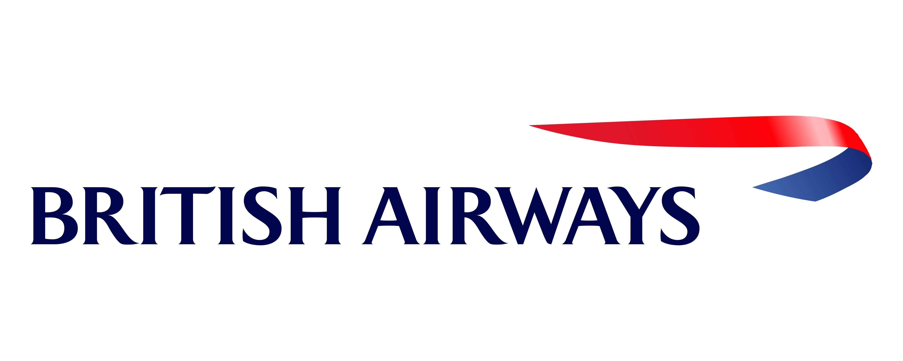
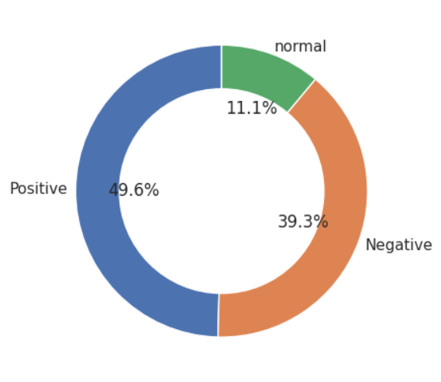
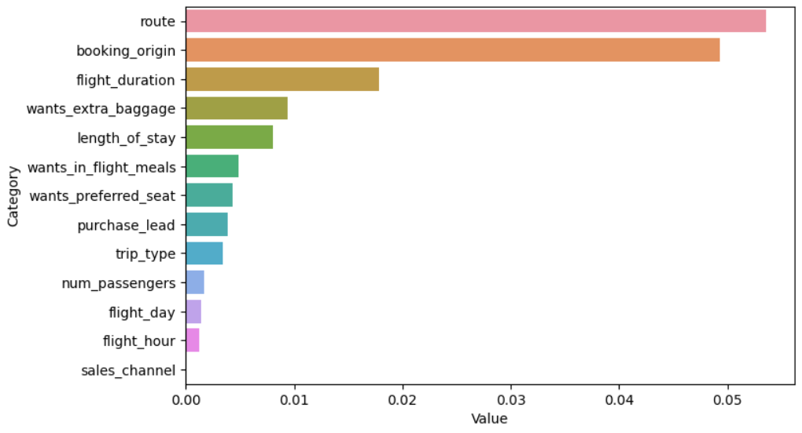

# BritishAirways OnlineInternship

In this virtual intership, I was given 2 task's.

## Task 1 : Web Scraping to gain company insights

- applying webscraping in unstructured data taken from the https://www.airlinequality.com/airline-reviews/british-airways
- analyze customer reviews using sentimental analysis to sort positive and negative reviews
- preparing a powerpoint representation to highlight our insights and analysis

---

## Task 2 : Predicting customer buying behaviour

- predicting customer buying behaviour using machine learning models
- Dataset (customer_booking) already be cleaned because it's dont have duplicate and null value, so we can start analyze the data.
- To find out, I made a machine learning model to take the feature importance, the results are:

